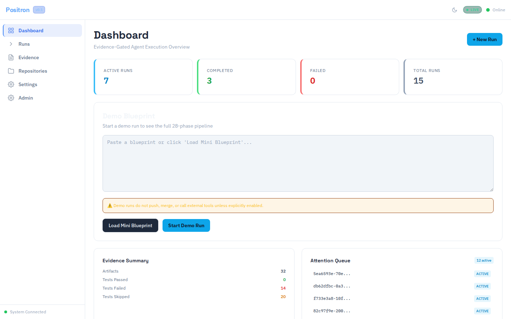
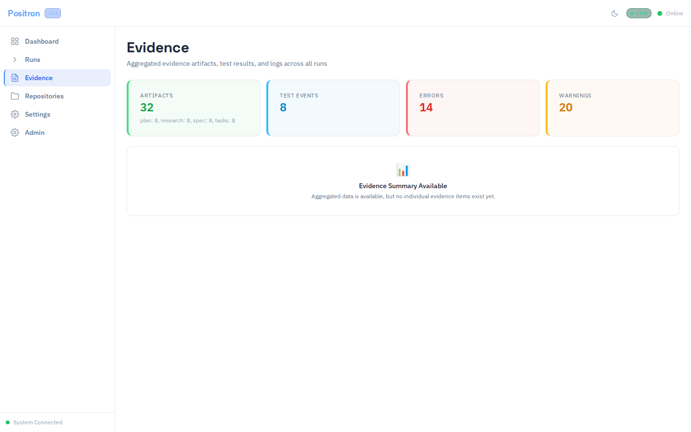
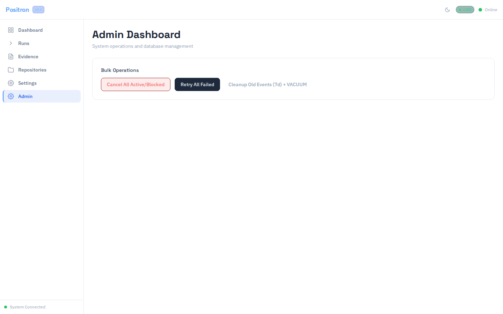
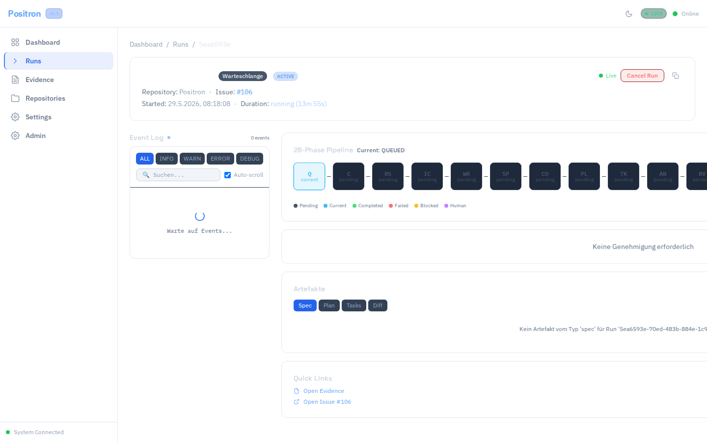

# Positron — Evidence-Gated AI Agent for Autonomous GitHub Issue Resolution

[](https://github.com/xxammaxx/Positron/releases)
[](https://github.com/xxammaxx/Positron/actions)
[](LICENSE)
[](https://github.com/xxammaxx/Positron)
[](https://www.typescriptlang.org/)
[](https://react.dev/)
[](https://vitejs.dev/)
[](https://nodejs.org/)

**Positron** is an evidence-gated AI agent execution system for GitHub Issues. It runs a **28-phase pipeline** (QUEUED → CLAIMED → SPECIFY → PLAN → TASKS → IMPLEMENT → REVIEW → MERGE → DONE → CLEANUP) where every phase produces verifiable artifacts. A happy-path run progresses through ~17 execution phases. Each step is auditable, replayable, and gated by evidence requirements.

> **🇩🇪 German:** Positron ist ein agentisches Ausführungssystem für GitHub Issues. Es durchläuft eine 28-Phasen-Pipeline (QUEUED → CLAIMED → SPECIFY → PLAN → TASKS → IMPLEMENT → REVIEW → MERGE → DONE → CLEANUP) und produziert für jeden Schritt prüfbare Artefakte.

---

## Demo

[▶️ Watch the Demo Video](docs/release/video-demo/positron-v0.2.0-demo.webm)


*Dashboard — Real-time SSE updates, run queue, system health*

| Evidence Explorer | Admin Panel | Run Detail |
|:---:|:---:|:---:|
|  |  |  |

---

## Quickstart

### Docker (Production — Full Stack)

```bash
cp .env.example apps/server/.env
# Edit apps/server/.env: set GITHUB_TOKEN, real modes
docker compose up --build
# → http://localhost:5173 (nginx reverse proxy)
```

### Local Development

```bash
cp .env.example apps/server/.env
npm install
# Terminal 1: Server
npm run dev:server
# Terminal 2: Web frontend
npm run dev:web
# → http://localhost:5173
# Note: Without Redis, the worker queue falls back to inline execution.
```

### Local Development (with Redis + Worker)

```bash
# Terminal 1: Redis
docker compose up redis -d
# Terminal 2: Worker
cd apps/worker && npm run dev
# Terminal 3: Server
npm run dev:server
# Terminal 4: Web
npm run dev:web
```

### CLI

```bash
./positron health           # System check
./positron runs             # Last 20 runs
./positron stats            # Admin statistics
./positron cancel <run-id>  # Cancel a run
```

---

## Key Features

- **🚀 28-Phase Pipeline** — QUEUED → CLAIMED → SPECIFY → PLAN → TASKS → IMPLEMENT → REVIEW → MERGE → DONE → CLEANUP. Each phase has mandatory evidence gates.
- **📊 Real-Time Dashboard** — SSE-powered live updates, run queue management, attention metrics, system health indicators.
- **🔍 Evidence Explorer** — Browse artifacts, test results, screenshots, and logs from every pipeline phase.
- **⚙️ Admin Panel** — Bulk cancel/retry, database statistics, workspace cleanup, system configuration.
- **🛡️ Safety Gates** — Kill-switch (`POSITRON_MERGE_KILL_SWITCH`), rate-limiting, CSP headers, secret redaction, audit trail enforcement.
- **🔔 Notifications** — Slack/Discord webhooks for run completion, failures, and state changes.
- **🐳 Docker** — Single `docker compose up --build` deploys the full stack (redis, worker, server, web, nginx).
- **📝 CLI** — `positron health`, `runs`, `stats`, `cancel`, `status` for operational management.
- **🎨 Brutalist Design** — Dark/light theme, mobile-responsive, accessible UI.

---

## Safety Architecture

Positron implements **evidence-gated progression** — no phase completes without verifiable proof:

| Layer | Mechanism | Enforced By |
|-------|-----------|-------------|
| **Merge Gate** | `POSITRON_MERGE_KILL_SWITCH=true` blocks all merges | Server-side config |
| **Push Gate** | `POSITRON_ENABLE_PUSH=false` blocks git pushes | Server-side config |
| **Evidence Gate** | Each pipeline phase requires passing tests + captured artifacts | Pipeline engine |
| **Audit Trail** | Every agent decision logged with timestamps + evidence hashes | Audit enforcer |
| **Rate Limiting** | Maximum 100 requests/minute per IP | Express middleware |
| **Secret Redaction** | `GITHUB_TOKEN`, API keys masked in logs | Log sanitizer |
| **Max Fix Loops** | Automatic stop after 3 failed attempts | State machine |

---

## Configuration

All settings via environment variables or `apps/server/.env`:

| Variable | Default | Description |
|:---------|:--------|:------------|
| `GITHUB_MODE` | `fake` | `real` for actual GitHub access |
| `GITHUB_TOKEN` | — | GitHub Personal Access Token |
| `POSITRON_ENABLE_PUSH` | `false` | Allow git push |
| `POSITRON_ENABLE_MERGE` | `false` | Allow auto-merge |
| `POSITRON_MERGE_KILL_SWITCH` | `true` | Emergency stop |
| `POSITRON_WORKSPACE_ROOT` | — | Path for real workspace |
| `POSITRON_WEBHOOK_URL` | — | Slack/Discord webhook |

---

## Tests

```bash
npx vitest run                  # 917 core/package tests (50 test files)
cd apps/web && npx vitest run   # 87 frontend tests (3 suites pass; 5 TSX suites pending Vitest transform fix)
npx playwright test             # E2E tests (advisory-only, see Issue #268)
```

Core/packages: **917/917 passing**. See [Current Project Status](#current-project-status) for the latest local gate results.

---

## Architecture

```
Positron/
├── apps/
│   ├── server/        # Express/TypeScript Backend (Port 3000)
│   │   ├── src/
│   │   │   ├── routes/        # REST API routes
│   │   │   ├── middleware/    # Auth, rate-limit, logging
│   │   │   └── services/     # Pipeline orchestration
│   │   └── __tests__/
│   └── web/           # React/Vite/Tailwind Frontend (Port 5173)
│       ├── src/
│       │   ├── components/   # Dashboard, Evidence, Admin, Runs
│       │   ├── hooks/        # SSE, API consumers
│       │   └── __tests__/
│       └── e2e/
├── packages/
│   ├── github-adapter/    # GitHub API (Fake/Real modes)
│   ├── speckit-adapter/   # Spec-Kit CLI integration
│   ├── opencode-adapter/  # OpenCode CLI integration
│   ├── run-state/         # State machine + SQLite
│   ├── sandbox/           # Git workspace (Fake/Real)
│   └── shared/            # Types, SSE events, utilities
├── docs/
│   ├── screenshots/       # Product screenshots
│   └── release/          # Release artifacts, proof reports
└── docker-compose.yml
```

### Tech Stack

| Layer | Technology |
|-------|-----------|
| **Runtime** | Node.js 24, TypeScript 5.9 |
| **Frontend** | React 18, Vite 5.4, Tailwind CSS 3 |
| **Backend** | Express 4, SQLite (better-sqlite3) |
| **State Machine** | Custom pipeline engine (28 phases) |
| **E2E Testing** | Playwright 1.60 |
| **Unit Testing** | Vitest 4.1 (core) / 1.6 (web) |
| **Container** | Docker + docker-compose |

---

## Dogfood Results (v0.1.0)

Positron successfully completed a **full dogfood run** on its own repository:

- **28-Phase State Machine**: Happy path (CLAIMED → DONE) completed in **13.7 seconds**
- **917 Tests**: All green (core/packages)
- **SSE Live Updates**: Dashboard + Event Timeline functional
- **PR Auto-Creation**: Blocked by Kill-Switch as configured
- **Evidence Trail**: Complete with screenshots, logs, test results

> Full proof: `docs/release/ui-workflow-proof-report.md`

---

## Current Project Status

Positron currently uses **local gates as the source of truth** for merge decisions.

### Mandatory local gates

- `git diff --check`
- `npx biome format .`
- `npm run build`
- `npm run typecheck`
- `npm test` — core: **917/917 passing** (50 test files)

### Known limitations

- **GitHub Actions**: advisory-only (zero-step CI), tracked in [Issue #268](https://github.com/xxammaxx/Positron/issues/268).
- **`npx biome check .`**: lint backlog with known warnings/errors — triaged separately.
- **`apps/web` tests**: 5 TSX test suites fail due to a Vitest JSX transform issue; 3 suites (87 tests) pass.
- **E2E tests**: not currently verified in local gates; advisory-only.

### See also

- [`docs/status/current-capabilities.md`](docs/status/current-capabilities.md)
- [`docs/status/known-limitations.md`](docs/status/known-limitations.md)
- [`docs/architecture/local-ci-flow.mmd`](docs/architecture/local-ci-flow.mmd)
- [`docs/architecture/evidence-flow.mmd`](docs/architecture/evidence-flow.mmd)
- [`docs/architecture/agent-flow.mmd`](docs/architecture/agent-flow.mmd)

---

## License

MIT

---

*Built with TypeScript, React, Vite, Tailwind CSS, Express, SQLite, Docker, and Playwright.*
