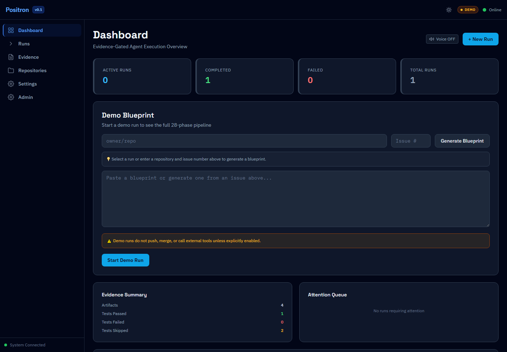
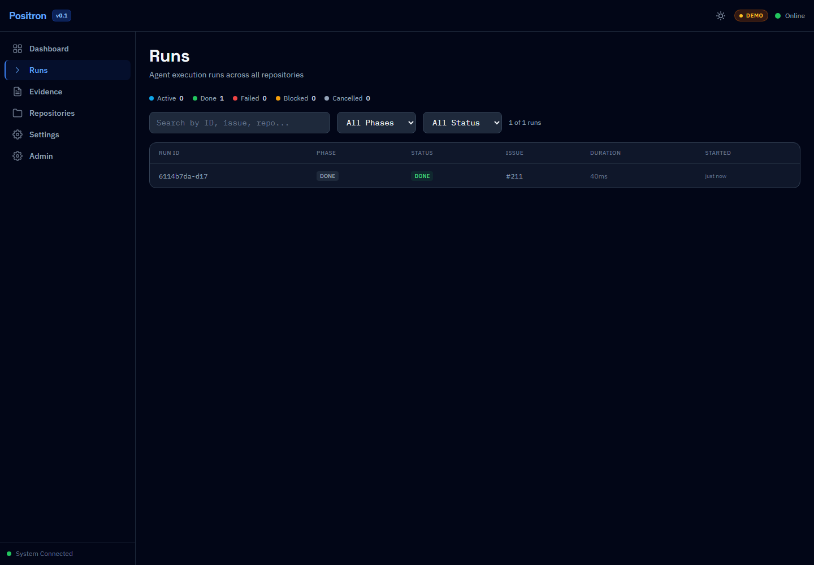
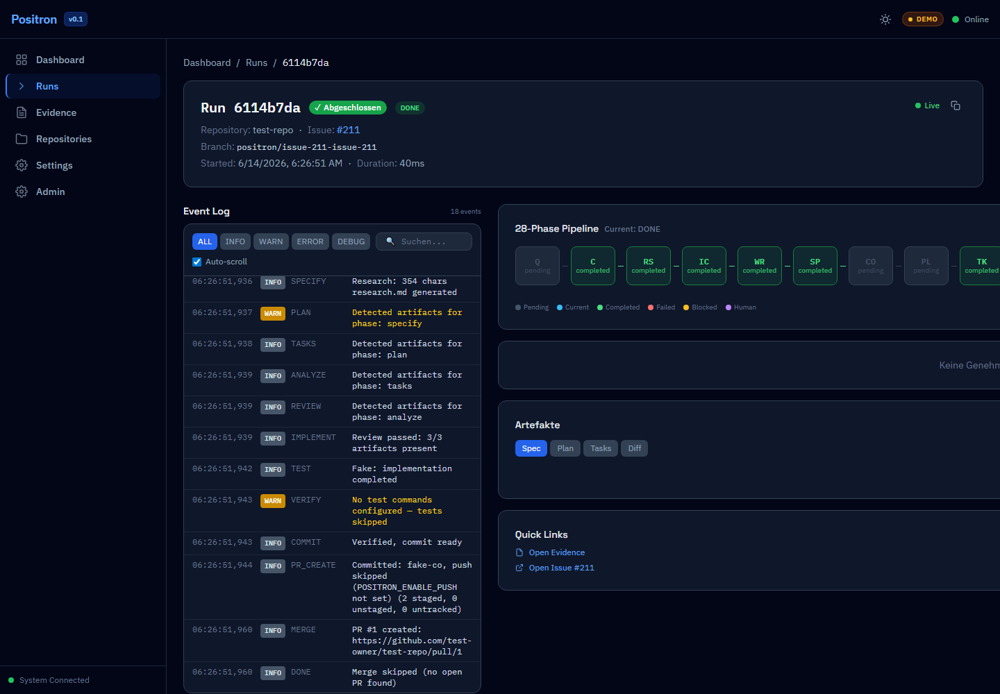
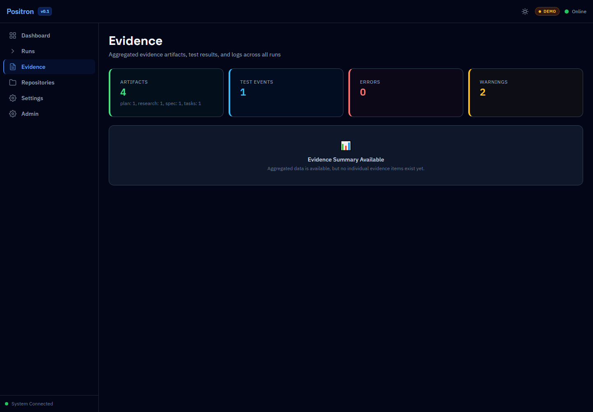
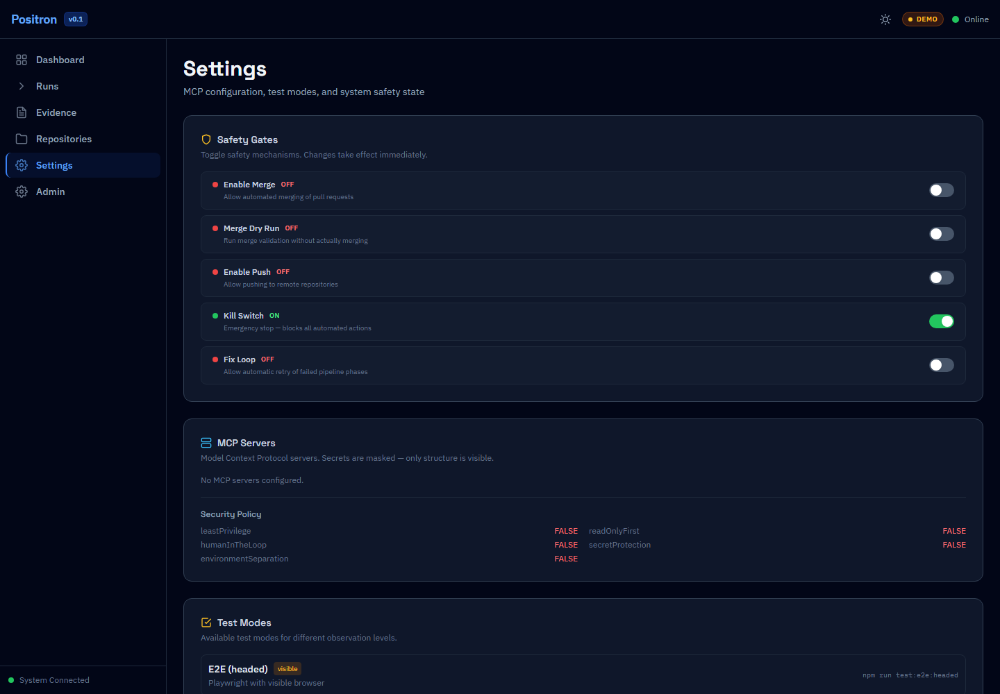
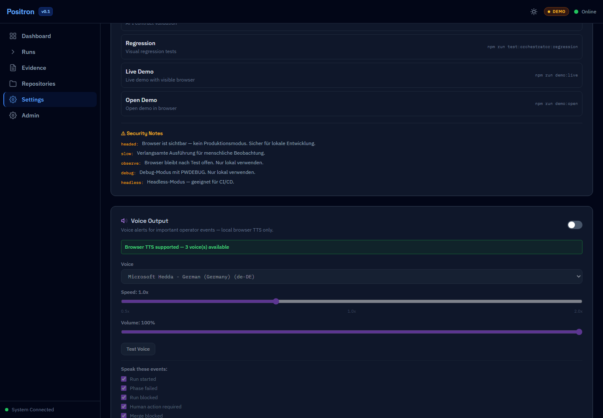
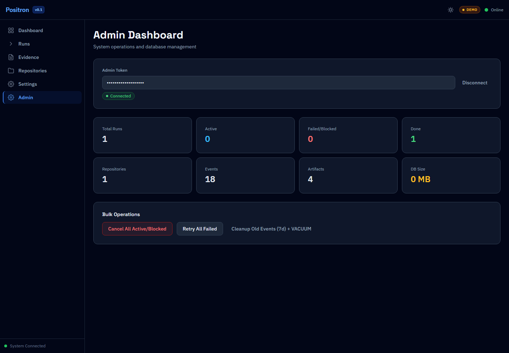
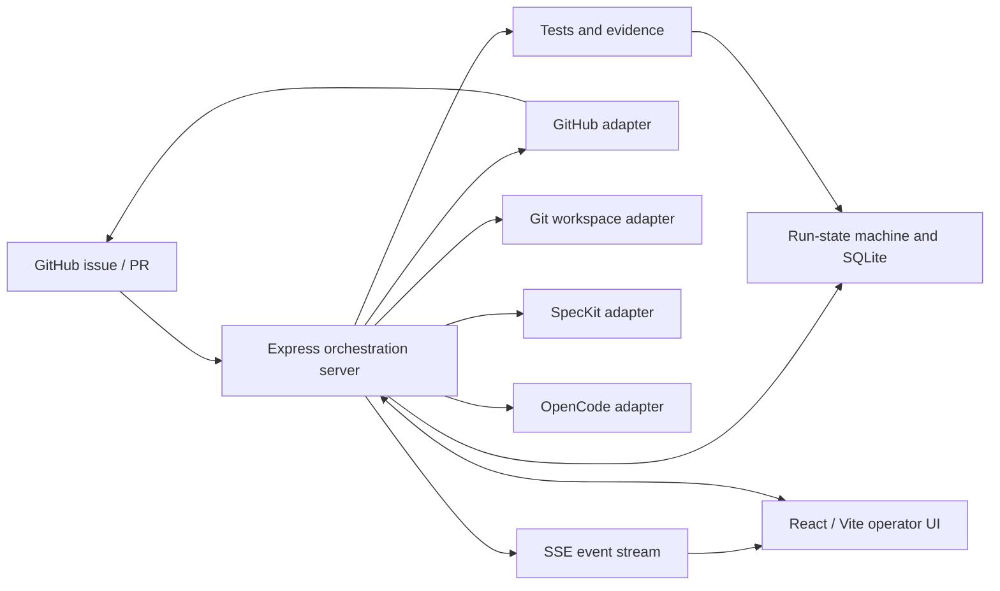

# Positron

Evidence-gated GitHub issue-to-PR orchestrator for supervised autonomous coding workflows.



Positron coordinates issue ingestion, specification, planning, implementation, review, testing, evidence collection, and pull-request delivery. It combines a React/Vite operator UI with a Node.js orchestration server, GitHub and CLI adapters, an explicit run-state machine, and safety gates for remote writes.

## Project Status

Positron is usable today as a supervised v0.2 prototype for demo/test repositories and explicitly approved low-risk repositories.

It is not a general-purpose unsupervised production automation system.

Some final hard-gate cleanup is still in progress. Check the latest CI status and open pull requests before merging or releasing. The repository currently contains mixed version metadata: package manifests and the UI still report `0.1.0`, while v0.2 release-candidate work is documented in the repository. This README does not publish or imply a new release.

## What Is Positron?

Positron turns one GitHub issue into a visible, reviewable workflow:

1. Load and claim an issue.
2. Gather repository context.
3. Produce a specification, plan, and task list.
4. Execute work through configured SpecKit and OpenCode adapters.
5. Run tests and collect evidence.
6. Prepare commits, pushes, and a pull request only when safety gates allow them.
7. Present the resulting pull request for maintainer review under the repository's workflow.

The default local mode uses fake adapters. It demonstrates orchestration and UI behavior without a GitHub token or remote writes.

## Capabilities

`Real` means the repository contains a real implementation. It does not mean that this documentation change exercised a live production repository.

| Capability | Status | Notes |
|---|---|---|
| GitHub issue reading | Real | Octokit-backed adapter in real mode |
| Issue claiming | Real | Managed labels and issue comments |
| Workspace clone | Real | `RealGitWorkspaceAdapter` when `POSITRON_WORKSPACE_ROOT` is configured |
| Commit | Real | Runs automatically in the commit phase when a configured workspace contains changes |
| Push | Gated | Disabled unless `POSITRON_ENABLE_PUSH=true` |
| Pull request creation | Real | GitHub adapter; depends on valid branch/workspace setup |
| Merge | Gated | Requires the enable flag and an inactive kill switch; no runtime human-approval gate is implemented |
| Dashboard UI | Real | React/Vite operator interface |
| SSE updates | Real | Server-sent run and evidence events |
| Evidence explorer | Real | Aggregated artifacts and execution reports |
| Voice output | Real | Local browser TTS, default OFF |
| SpecKit/OpenCode execution | Config-dependent | Fake by default; real CLIs require explicit setup |
| AI UI review | Deferred | Discovery/documentation track only |
| SonarQube | Deferred | Discovery/documentation track only |
| External AI providers | Deferred | No production provider integration claimed |

## Screenshots

These PNGs were captured on June 14, 2026 from a freshly started local instance using fake adapters, an isolated SQLite database, and a completed demo run. The images contain no real token, private filesystem path, or personal repository data.

| Runs | Run pipeline |
|---|---|
|  |  |

| Evidence | Safety controls |
|---|---|
|  |  |

| Voice output | Admin |
|---|---|
|  |  |

A fresh mobile screenshot was not produced during this documentation run, so no mobile evidence is claimed.

## Quickstart

### Requirements

- Node.js 22 or newer
- npm
- Git
- Optional: Docker Desktop or Docker Engine with Compose

### Demo Mode - No GitHub Token Required

```bash
npm install
npm run dev:demo
```

The demo command forces fake adapters, clears any inherited real-workspace path, uses an ignored project-local demo database, disables push/merge/fix-loop behavior, activates the merge kill switch, and overrides relevant values from any local server `.env`.

```text
Frontend: http://localhost:5173
Backend:  http://localhost:3000
Health:   http://localhost:3000/api/health
```

Verify health:

```bash
curl http://localhost:3000/api/health
```

### Real / Supervised Mode

Real mode can read or write GitHub state. Start with push and merge disabled.

```bash
cp .env.example apps/server/.env
```

Set at minimum:

```env
POSITRON_GITHUB_MODE=real
POSITRON_SPECKIT_MODE=real
POSITRON_OPENCODE_MODE=real
GITHUB_TOKEN=replace_with_github_token
POSITRON_REPO_OWNER=your_github_username
POSITRON_REPO_NAME=your_repo_name
POSITRON_WORKSPACE_ROOT=/absolute/path/to/isolated/workspaces

POSITRON_ENABLE_PUSH=false
POSITRON_ENABLE_MERGE=false
POSITRON_ENABLE_FIX_LOOP=false
POSITRON_MERGE_KILL_SWITCH=true
```

Run a local preflight and start both services:

```bash
npm run typecheck
npm run dev
```

The repository does not currently provide `npm run doctor`; do not rely on that command. Use the health endpoint, `npm run typecheck`, and the validation commands below.

### Docker

For a local full-stack demo:

```bash
docker compose up --build
```

On Windows PowerShell, export the automatic home path if Compose warns that `HOME` is unset:

```powershell
$env:HOME = $HOME
docker compose up --build
```

Then open `http://localhost:5173`. Compose defaults the adapters to fake mode and keeps push/merge disabled. Review host volume mounts and supply explicit environment values before attempting supervised real mode.

## Safety Defaults

```env
POSITRON_ENABLE_PUSH=false
POSITRON_ENABLE_MERGE=false
POSITRON_ENABLE_FIX_LOOP=false
POSITRON_MERGE_KILL_SWITCH=true
```

Additional boundaries:

- Fake adapters are the default.
- Remote push requires an explicit enable flag.
- Merge requires both an enable flag and an inactive kill switch.
- Force-push operations are blocked by policy.
- Runs stop after the configured maximum fix loops.
- Secrets are redacted from application evidence and must never be committed.
- Repository policy requires maintainer review before sensitive remote actions, but the runtime does not currently enforce a separate human-approval gate.

## Architecture



| Area | Location |
|---|---|
| Web UI | `apps/web/` |
| API and orchestrator | `apps/server/` |
| Background worker | `apps/worker/` |
| GitHub API adapter | `packages/github-adapter/` |
| SpecKit adapter | `packages/speckit-adapter/` |
| OpenCode adapter | `packages/opencode-adapter/` |
| Run state and persistence | `packages/run-state/` |
| Git workspace and policies | `packages/sandbox/` |
| Shared contracts | `packages/shared/` |

## GitHub Workflow

Positron treats GitHub as the visible source of truth:

```text
Issue
  -> repository context
  -> specification
  -> plan
  -> tasks
  -> implementation
  -> tests and evidence
  -> review
  -> draft pull request
  -> maintainer review (repository workflow)
  -> flag- and kill-switch-gated merge
```

Each run is expected to record decisions, errors, test results, acceptance-criteria mapping, and delivery status in its issue or pull request. Maintainer review is a governance requirement outside the current runtime state machine.

## Evidence and QA

Run the core gates from the repository root:

```bash
npm test
npm run build
npm run coverage:safety
npm run test:contracts
npm run typecheck
```

Optional browser validation:

```bash
npx playwright test
```

Do not infer current health from historical fixed-count badges or archived release reports. Use the latest GitHub Actions result and the active pull request evidence. Generated traces, videos, databases, and `test-results/` files are local artifacts and must not be committed.

Local validation for this documentation change on June 14, 2026:

| Gate | Result |
|---|---|
| Demo quickstart and health | PASS - frontend/backend HTTP 200, fake mode |
| Root TypeScript build | PASS |
| Web production build | PASS with existing browser-externalization warnings |
| Contract tests | PASS - 140/140 |
| Web tests | PASS - 196/196, with existing React `act()` warnings |
| Typecheck | PASS |
| Lint | FAIL - existing baseline reports 293 errors and 404 warnings outside this documentation scope |
| Root `npm test` | PARTIAL - 689/690; known Windows `/tmp` baseline failure tracked by open hard-gate work |
| Safety coverage suite | PARTIAL - 397/399; same `/tmp` failure plus one property-test timeout |
| Issue templates and README links | PASS - four YAML templates parsed and all local links resolved |
| Screenshot evidence | PARTIAL - seven verified desktop views; fresh mobile view not completed |

## Voice Output

Voice output uses the browser Web Speech API:

- Default: OFF
- Processing: local browser TTS
- External speech service: none
- Purpose: optional operator alerts for important run events

Voice Phase 2, Whisper, and Piper integrations are not part of the current implementation.

## What Is Real vs Demo?

| Area | Demo mode | Real / supervised mode |
|---|---|---|
| GitHub data | Fake adapter and deterministic fixtures | Octokit with an explicit token |
| SpecKit/OpenCode | Fake adapters | Local CLIs with explicit real-mode flags |
| Workspace | Fake unless configured | Isolated real Git workspace |
| Pipeline/UI/SSE | Real local application behavior | Same application behavior |
| Push | Disabled | Explicitly gated |
| Merge | Disabled | Explicitly gated plus kill switch |
| Evidence | Real local artifacts/events | Evidence from configured real execution |

## Known Limitations

- This is a supervised prototype, not an unattended production service.
- Package/UI version metadata is not yet consistently aligned with the v0.2 documentation track.
- The legacy `demo:open*` scripts reference a missing helper and are not the recommended quickstart; use `npm run dev:demo`.
- The standard issue-URL "New Run" path showed a baseline validation failure during this documentation run. The dedicated fake-mode demo-run path completed successfully.
- Runtime coverage outside safety-critical modules has documented gaps.
- A hard-gate cleanup pull request was open when this README was written.

## Roadmap and Deferred Tracks

Current near-term work:

- Complete hard-gate cleanup and re-run release evidence.
- Reconcile version metadata before a release.
- Improve runtime coverage without weakening safety thresholds.
- Harden supervised real-mode setup and diagnostics.

Deferred discovery tracks:

- AI-assisted UI review
- SonarQube integration
- Sentry or equivalent hosted observability
- External AI-provider integrations
- Voice Phase 2 / Whisper / Piper
- Public docs site or GitHub Pages

## Contributing

Read [CONTRIBUTING.md](CONTRIBUTING.md) and [AGENTS.md](AGENTS.md) before starting work. Every change must be tied to one GitHub issue and follow the repository's spec-plan-tasks workflow.

## Security

Do not report vulnerabilities in a public issue. Follow [SECURITY.md](SECURITY.md), keep `.env` files and runtime databases out of Git, and leave push/merge disabled until a human explicitly approves the target repository.

## License

Licensed under the [MIT License](LICENSE).
